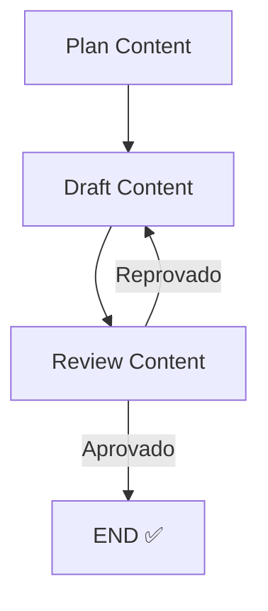

# 🤖 Agente de Geração de Conteúdo Inteligente LLL (LangGraph + LangChain + LangSmith)

Este projeto implementa um **Agente de Geração de Conteúdo autónomo** capaz de **planear, redigir e revisar artigos de forma iterativa**.  
Utiliza a biblioteca **LangGraph** para definir o fluxo de trabalho cíclico (Planear → Redigir → Revisar) e o **FastAPI** para expor a funcionalidade como um serviço web.

---

## 🚀 Arquitetura e Componentes
A inteligência do agente é construída sobre três pilares principais da stack de LLMs:

### 1. LangChain – *O Construtor de Módulos*
A **LangChain** fornece os blocos de construção fundamentais que permitem comunicar com o LLM e estruturar as interações.  

- **Integração com LLM (Groq)** → via `ChatGroq` para inicializar o modelo `gemma2-9b-it`.  
- **Gestão de Prompts** → com `ChatPromptTemplate`, `SystemMessage` e `HumanMessage` para instruções específicas em cada nó.  
- **Chains** → combinam prompt + modelo em execuções encadeadas.  

👉 Atua como o **motor linguístico** do agente.  

---

### 2. LangGraph – *O Orquestrador do Ciclo*
A **LangGraph** transforma chamadas isoladas a LLMs num **workflow iterativo com memória**.  

- **Estado Global (`ContentAgentState`)** → partilha e atualiza variáveis (`topic`, `outline`, `draft`, `review_notes`).  
- **Nós (Nodes)** → funções principais:  
  - `plan_content()` → cria o plano do artigo.  
  - `draft_content()` → gera o rascunho.  
  - `review_content()` → avalia e aprova/reprova.  
- **Roteamento Condicional** → se reprovado, retorna a `draft_content`; se aprovado, segue para `END`.  

👉 Atua como o **cérebro do fluxo de geração**.  

---

### 3. LangSmith – *O Debugger e Observador*
O **LangSmith** fornece rastreabilidade e monitorização em tempo real.  

- **Tracing Automático** → regista prompts, respostas e mutações do estado.  
- **Debugging do Ciclo** → identifica loops infinitos ou falhas de lógica.  
- **Métricas** → latência, tokens e performance de cada nó.  

👉 Atua como o **radar do agente**, permitindo observar e otimizar.  

---

## 🛠️ Configuração e Execução

### 1. Criar ambiente virtual (venv)
No diretório do projeto:

```bash
python -m venv .venv
source .venv/bin/activate   # Linux / Mac
.venv\Scripts\activate      # Windows PowerShell
```

### 2. Instalar dependências
Com o ambiente ativo:

```bash
pip install -r requirements.txt
```

### 3. Configurar variáveis de ambiente
Crie um ficheiro `.env` na raiz do projeto com:

```env
GROQ_API_KEY="a sua chave groq aqui"
LANGCHAIN_API_KEY="a sua chave langsmith aqui"

# Ativar tracing no LangSmith
LANGCHAIN_TRACING_V2=true
LANGCHAIN_PROJECT=Content-Generator-Agent
```

### 4. Executar o agente
O script principal pode ser corrido em dois modos:

```bash
python content_agent.py
```

- **Modo 1: CLI** → pede o tópico no terminal e executa uma vez.  
- **Modo 2: Servidor FastAPI** → levanta um endpoint em `http://0.0.0.0:8000/generate-content`.  

### 5. Observar no LangSmith
Para acompanhar a execução:  

1. Acesse [https://smith.langchain.com](https://smith.langchain.com)  
2. Faça login com a mesma conta da sua `LANGCHAIN_API_KEY`.  
3. Abra o projeto `Content-Generator-Agent`.  
4. Veja os **traces em tempo real**: prompts, respostas, loops de revisão, consumo de tokens e latência.  

---

## 📊 Fluxo do Agente (Mermaid)



---

✍️ Desenvolvido para demonstrar a integração de **LangChain (módulos + prompts) + LangGraph (orquestração do ciclo) + LangSmith (observabilidade)** em um agente autónomo de geração de conteúdo.
